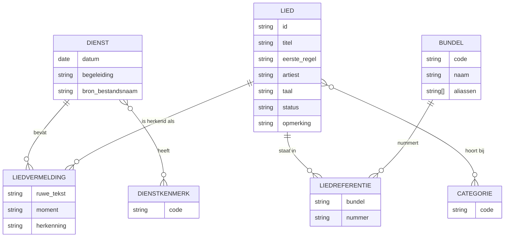
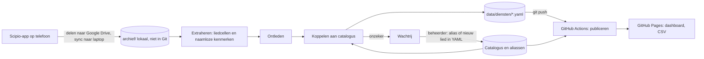

# Liturgiestatistiek Westerkerk - functioneel ontwerp

Status: concept, derde versie. Verwerkt twee rondes antwoorden en de analyse van achttien liturgieën (24 mei tot en met 20 september 2026) plus het bestaande stamgegevens-sheet. Bedoeld om samen aan te scherpen voordat er code komt.

## Doel

Mensen die in de Westerkerk liturgieën opstellen (voorgangers, muziekteams, liturgiecommissie) helpen bij de liedkeuze, op basis van wat er de afgelopen weken, maanden en jaren daadwerkelijk gezongen is.

Typische hulpvragen:

- Wat is er de afgelopen weken gezongen?
- Welke liederen zijn onlangs voor het eerst gezongen en zijn toe aan een tweede keer, zodat ze inslijten?
- Welke liederen zingen we te vaak?
- Welke bekende liederen zijn een tijd niet aan bod geweest?
- Wanneer is dit lied allemaal gezongen?
- Welke liederen over doop, avondmaal of rouw hebben we wel eens gezongen?

Nadrukkelijk geen doel: de liedkeuze overnemen. Het gereedschap informeert, mensen kiezen.

## Uitgangspunten en genomen besluiten

- Publieke informatie op de leeskant, geen authenticatie.
- Geen eigen server, geen database die onderhouden moet worden, gratis hosting. Concreet: GitHub-repository `gvanderploeg/liturgiestatistiek` met GitHub Pages en GitHub Actions.
- **Persoonsgegevens blijven buiten de publieke repository.** De liturgie-PDF bevat namen (voorganger, koster, lezers, doopouders, dopelingen). De PDF's worden daarom niet gepubliceerd. Alleen liedvermeldingen en een handvol naamloze dienstkenmerken worden opgeslagen, en die kenmerken worden genormaliseerd naar een vaste woordenlijst omdat ook het veld Bijzonderheden namen kan bevatten ("Doop Joël V. en Micha P.").
- De data is klein. Uit de achttien voorbeeldliturgieën: 4 tot 10 liederen per dienst, gemiddeld bijna 7. Dus 300 tot 400 liedvermeldingen per jaar. Alles past in een browser.
- Eén dienst per datum. Zijn er twee diensten op een dag, dan worden hun liederen samengevoegd onder die datum.
- Coupletten worden niet vastgelegd. Couplet-aanduidingen blijven wel zichtbaar in de ruwe liedvermelding.
- Ruwe tekst bewaren betekent: de tekst van de liedvermelding zoals die in de liturgie staat. Niet de hele PDF.
- De preektekst wordt niet opgeslagen. Kan later toegevoegd worden als er een concrete vraag komt.
- Facultatieve liederen zijn een uitzondering die in definitieve liturgieën niet voorkomt. Geen apart kenmerk; als het toch voorkomt telt het gewoon mee.
- Normalisatie is nooit 100% automatisch. Het ontwerp gaat uit van een menselijke correctieslag die klein blijft doordat correcties hergebruikt worden.
- Duidelijke lagen met eenvoudige bestandsformaten als koppelvlak, zodat elke laag los te herschrijven is. De code mag door AI onderhouden worden; de beheerder leest mee en denkt mee (Java-achtergrond, Python als leerdoel).
- Aliassen, blacklist en categorieën bewerkt de beheerder in YAML-bestanden. Geen beheerscherm in de eerste versies.
- Historie: de achttien liturgieën vanaf 24 mei 2026 zijn beschikbaar en vormen de startdata. Het oude Google-sheet (2022 tot 2025) wordt niet als geschiedenis geïmporteerd; wel worden de catalogus-tabbladen eruit gebruikt.
- Scipio is alleen via de mobiele app te benaderen. Ophalen gebeurt daarom handmatig door de beheerder; de verwerking draait lokaal. Automatisch ophalen is een onderzoeksonderwerp voor later, geen uitgangspunt.
- Drempelwaarden op het dashboard zijn instelbaar. De eerste versie gebruikt vaste standaardwaarden; later kunnen instellingen per persoon in de browser bewaard worden.
- Dienstkenmerken uit een vaste lijst: doop, avondmaal, belijdenis, bevestiging, Pinksteren, Pasen, Kerst, Advent, startzondag, dankdag, biddag. Uit te breiden zodra nodig.
- Momenten beperkt tot vier: aanvang, kindmoment, luisterlied, zegenlied. Alleen vastgelegd als van toepassing. Doop en avondmaal zijn liedcategorieën, geen momenten.
- Hetzelfde lied twee keer in één dienst telt als één vermelding.
- De catalogus groeit organisch via de wachtrij, met het stamgegevens-sheet als start. Een batch-import van bundels als Liedboek 2013 of DNP alleen als later blijkt dat dat loont.
- Luisterliederen tellen in alle weergaven gewoon mee als lied. Het moment luisterlied blijft zichtbaar en is te filteren.
- De verwerking gaat ervan uit dat de PDF's in de lokale map `archief/` staan. Hoe ze daar komen (delen vanaf de telefoon, Google Drive) regelt de beheerder voorlopig handmatig; dat deel van het proces is nog te veel in beweging om vast te leggen.
- Feedback van gebruikers via de website is geen onderdeel van de eerste versies.
- Verwerking in Python.

## Gebruikers en rollen

**Liturgie-opsteller** (lezer). Voorganger, muziekteamlid, liturgiecommissie. Wil op één dashboard de belangrijkste vragen beantwoord zien en kan doorklikken naar detail. Gebruikt de website, hoeft niets te installeren of in te loggen.

**Beheerder** (schrijver). Haalt liturgieën op, draait de verwerking, lost niet-herkende liederen op, onderhoudt catalogus, aliassen, blacklist en categorieën. Voorlopig alleen Geert.

**Nieuwsgierige** (lezer met eigen vragen). Kan de data downloaden (CSV) of ter plekke filteren.

## De liturgie-PDF als bron

De Westerkerk gebruikt een vast Word-sjabloon. In alle achttien onderzochte liturgieën is de structuur gelijk; de invulling van de liedregels varieert sterk per opsteller.

### Wat vast is

Bestandsnaam meestal `JJJJMMDD Eredienst Westerkerk.pdf`, met uitzonderingen ("Eredienst Westerkerk 24 mei 2026 -.pdf"). De datum wordt daarom uit het document zelf gehaald, met de bestandsnaam als controle.

**Blok ALGEMEEN**, een tabel label / waarde. Altijd aanwezig: `Datum` ("zondag 31 mei 2026" of "21 juni 2026"), `Bijzonderheden` (leeg, "-", of tekst), `Type muziek begeleiding` ("Band", "Orgel", "Orgel/Piano", "-"). Alle overige regels bevatten personen en worden genegeerd.

**Blok ORDE VAN DIENST**, een tabel met twee kolommen onder drie kopjes ("EER AAN GOD", "HOREN EN ANTWOORDEN NAAR GOD", "OP WEG GAAN MET GOD"). Liederen staan op regels waarvan de linkerkolom het woord "Lied" bevat. De gele celvulling die het sjabloon voor liedcellen gebruikt is geen bruikbaar signaal: opstellers kleuren ook andere ingevulde cellen geel. Het label is dus het enige criterium; rijen zonder liedlabel die toch naar een lied verwijzen (bijvoorbeeld "Geloofsbelijdenis gezongen: Opwekking 575") komen als kandidaat in de wachtrij.

Technisch aandachtspunt uit de bouw: opstellers zetten soms geneste tabellen of extra kolomlijnen in de inhoudscel, waardoor de celherkenning van pdfplumber versnippert. De extractie leidt rijen daarom af uit de horizontale lijnen van de labelkolom en splitst de tekst per rij op de eerste kolomgrens. Dat werkt op alle achttien liturgieën, ook waar cellen over meerdere regels lopen.

### Hoe de liedregels variëren

Een greep uit de rechterkolom van de achttien liturgieën:

```
Opwekking 815 (Vul dit huis met glorie)
Opwekking 640: Ik hef mijn ogen op naar de bergen
Opwekking 623 -Laat het huis gevuld zijn..
Witter dan sneeuw (Opw 811)
Opw. 220/JdH197 Volle verzeek'ring Jezus is mijn
Opwekking 797 (Sela – Breng ons samen)
Opwekking 849 - refrein
Meer dan een wonder – Kinga Ban
Sela: Breng ons samen
Ik wens jou (trinity)
LB 870:1, 3, 4, 8 Heilige God, geprezen zij
Liedboek_2013 lied 912 vers 1, 2, 4 en 6. Neem mijn leven,
NLB 413 vers 1,2 en 3 Grote God, wij loven U
Psalm 24:1 DNP De aarde is met al wat leeft
DNP psalm 133 vers 1 en 2 'Wat is het goed'
Psalm 119:40 uit de berijming van het GKV Kerkboek 2017*
Psalm 103, The Psalm Project
Loof de Heer zijn ziel (Psalm Project 103)
E&R2, 423 (Heer, U bent mijn leven)
OK4kids 74 (Een wijs man bouwde zijn huis)
Opwekking kids 233 (God heeft een plan met je leven)
Lichtstad met uw paar'len poorten (o.a. Evangelische Liedbundel 413)
Ar 124 Zidoel masieh tasbie (Geef lofprijzing aan de
Holy Forever
Run to the father
Lam van God, Lam van God, dat de zonde der wereld draagt
```

Wat dit betekent voor het ontleden:

- **Drie hoofdvormen.** Bundel-nummer-titel ("Opwekking 815 (Titel)"), titel-artiest in wisselende volgorde en met wisselend scheidingsteken ("Titel – Artiest", "Artiest: Titel", "Titel (artiest)"), en kale titel of eerste regel ("Holy Forever"). De eerste vorm is hard te koppelen; de andere twee via tolerante titelvergelijking van de fragmenten waarin de regel uiteenvalt. Artiesten worden niet apart herkend of bijgehouden: er zijn er te veel en de meeste bundelliederen komen oorspronkelijk toch van een artiest. Een artiestnaam is gewoon een fragment dat nergens op matcht.
- **Bundelaliassen** die al in achttien diensten voorkomen: Opwekking, Opw., Opw; Opwekking kids, OK4kids; LB, NLB, Liedboek, Liedboek_2013, Liedboek 2013; DNP, De Nieuwe Psalmberijming, "Psalm N DNP"; PvN; ELB, Evangelische Liedbundel; JdH; E&R, E&R2, E&R liedbundel 2; GKV Kerkboek 2017, Gereformeerd Kerkboek; TPP, The Psalm Project, Psalm Project; Hemelhoog; Ar (Arabische liederen op de startzondag). Hoofdletterongevoelig.
- **Ruis** die weggehaald moet worden: "zingen:", "zingen (als amen)", couplet-aanduidingen (":1, 3, 4, 8", "vers 1 en 2", "3.5"), toevoegingen als "tweetalig", "met tekst op Powerpoint", "refrein", sterretjes en dubbele haakjes.
- **Cellen lopen soms door** op een tweede regel. De extractie moet per cel werken, niet per tekstregel.
- **Nummering is niet betrouwbaar** ("Lied 2" twee keer, "Lied 1a", "Lied 1 en 2", "Lied 5" zonder "Lied 4"). We gebruiken de documentvolgorde.
- **Een "Lied"-label garandeert geen lied.** "Zegen > Lied 8" had als inhoud "Zegen uitspreken". Daarom het dubbele signaal met de celkleur, en bij twijfel de wachtrij.
- **Kruisverwijzingen in de tekst** ("Opwekking 797 (Sela – Breng ons samen)", "Opw. 220/JdH197") zijn nuttig: ze leveren gratis extra referenties voor de catalogus, mits de beheerder ze bevestigt.

### Moment in de liturgie

Het label in de linkerkolom geeft soms het moment aan, in wisselende schrijfwijze: "Lied 3 (kinderlied)", "Lied 4 - kinderlied", "Kindlied - " in de inhoud, "Lied 1 (votum)", "Votum en groet = Lied 1", "Votum en groet: Lied 1", "Zegen > Lied 7", "Lied 7 - uitlooplied", "Lied 7 (Luisterlied door de band)". Positie is een aanvullende hint (eerste lied, na de regel "Kindmoment", na "Zegen").

Vier momenten worden vastgelegd, alleen als ze van toepassing zijn:

- **aanvang**: het eerste lied van de dienst, inclusief een gezongen votum en groet.
- **kindmoment**: het lied rond het kindmoment.
- **luisterlied**: door de band gezongen, niet door de gemeente.
- **zegenlied**: het lied bij of na de zegen, inclusief een uitlooplied.

Een lied zonder een van deze momenten krijgt geen moment. Doop en avondmaal zijn geen momenten: ze komen niet elke dienst voor en hun plek in de dienst wisselt. Een label als "Lied 4 (dooplied)" is wel een sterke suggestie voor de liedcategorie doop, die de beheerder bevestigt.

### Bijzonderheden

Waarden in de achttien liturgieën: Doopzondag (3x), Heilig Avondmaal (2x), 1e Belijdenisdienst, Pinksteren, Startzondag, "Liederen via YouTube / Beamer", en één keer een tekst met namen van dopelingen en "bevestiging diakenen". Dit veld gaat niet letterlijk de data in. De extractie herkent trefwoorden en zet ze om naar een vaste lijst dienstkenmerken: doop, avondmaal, belijdenis, bevestiging, Pinksteren, Pasen, Kerst, Advent, startzondag, dankdag, biddag. Onbekende tekst komt bij de beheerder in de wachtrij, die kiest een kenmerk of negeert het. Zo komen namen nooit in de publieke data.

## Domeinmodel



**Dienst.** Eén datum. Begeleiding: band, orgel, orgel/piano, geen. Dienstkenmerken uit de vaste lijst hierboven (nul of meer). Bron-bestandsnaam verwijst naar de PDF in het niet-publieke archief.

**Liedvermelding.** Eén liedcel uit de liturgie. Bewaart altijd de ruwe celtekst, plus de koppeling naar het genormaliseerde lied. Moment (aanvang, kindmoment, luisterlied, zegenlied) alleen als het van toepassing is. Herkenning: automatisch / handmatig bevestigd / onbekend. Komt hetzelfde lied twee keer in een dienst voor (bijvoorbeeld een herhaald refrein bij de zegen), dan wordt het één keer vermeld.

**Lied.** Het canonieke lied, los van de bundel waarin het staat. Een lied kan in meerdere bundels staan, dus bundel-plus-nummer zit in een aparte referentietabel. Voorbeelden uit de data: Opwekking 797 is Sela "Breng ons samen"; Opwekking 687 is Sela "Heer, wijs mij uw weg"; Opwekking 220 is Johannes de Heer 197; "Doop" van Sela is Hemelhoog 502. Artiest voor liederen zonder bundel (Kinga Ban, Trinity, Charity Gayle, Elevation Worship). Status: normaal / blacklist / favoriet. Opmerking: vrije tekst voor de beheerder.

**Bundel.** Met de aliassen uit de vorige sectie. Wordt aangevuld zodra een nieuwe schrijfwijze opduikt.

**Categorie.** Inhoudelijke of praktische eigenschap van het lied, een lied kan er meerdere hebben. Startset: kinderlied, psalm, Engelstalig, luisterlied, zegenlied, doop, avondmaal, Advent, Kerst, Pasen, Pinksteren. Categorieën worden handmatig door de beheerder toegekend; de verwerking mag ze voorstellen (Opwekking Kids is kinderlied, "(Luisterlied)" in de tekst, gezongen als dooplied op een doopzondag), maar kent ze nooit zelf toe.

**Thema-vragen** ("welke liederen over doop hebben we wel eens gezongen") gaan over de categorie van het lied, dus over de inhoud. Een dooplied is een dooplied, ook als het op een gewone zondag gezongen is. Het moment en de dienstkenmerken zijn aparte, aanvullende filters ("wat zongen we op doopzondagen", "wat zongen we als zegenlied") en dienen daarnaast als suggestie voor de beheerder bij het toekennen van categorieën.

## Normalisatie

**Extraheren.** PDF naar tabellen met cellen, per blok. Uit ALGEMEEN alleen datum, bijzonderheden en begeleiding. Uit ORDE VAN DIENST alle rijen met label, inhoud, celkleur en sectiekopje.

**Liedregels selecteren.** Label bevat "Lied" en de cel is niet leeg: liedvermelding. Rijen zonder liedlabel maar met een bundelnaam (Sela telt als bundel) of het woord lied, zingen of gezongen in de inhoud ("Geloofsbelijdenis gezongen: Opwekking 575", "beginnen met Votum en groet van Sela"): kandidaat voor de wachtrij. Alles anders wordt weggegooid. Hier verdwijnen de persoonsnamen.

**Dienstkenmerken afleiden.** Bijzonderheden tegen de trefwoordenlijst; onbekende tekst naar de wachtrij. Datum uit het Datum-veld (Nederlandse maandnamen), gecontroleerd tegen de bestandsnaam.

**Ontleden.** Bewust ruim. Per liedvermelding: bundelaliassen en nummers precies herkennen (dat is de harde sleutel), daarna alle getallen en een handvol vulwoorden weghalen en de rest grof opknippen op scheidingstekens (streepje, dubbele punt, haakjes) tot titelfragmenten. Moment afleiden uit label en positie. Geen aparte herkenning van artiesten, coupletnotaties of andere bijzonderheden: wat niet klopt vangt de koppeling tolerant op, en anders de wachtrij.

**Koppelen aan de catalogus.** Bundel-plus-nummer is een harde sleutel. Titelfragmenten worden vergeleken met titels, eerste regels en aliassen in de catalogus: hoofdletters, leestekens en woordvolgorde tellen niet, een fragment van drie of meer woorden dat letterlijk in een langere eerste regel voorkomt telt als gelijk. Noemt de regel een bundel zonder nummer ("Sela: ..."), dan winnen liederen uit die bundel bij gelijke stand. Boven een drempel automatisch, daaronder wachtrij met de beste kandidaten erbij. Een enkele misser is aanvaardbaar: het alternatief is een steeds preciezere ontleding die toch achter de praktijk aanloopt, terwijl elk besluit in de wachtrij een alias oplevert die de fout blijvend herstelt.

**Wachtrij voor de beheerder.** Eén lokaal bestand (`werk/wachtrij.yaml`, niet in Git) met alle twijfelgevallen, in vier soorten:

- *lied*: een liedregel die niet herkend is, met kandidaten en een voorstel voor een nieuw lied. Voorstellen die op een bundelverwijzing berusten ("NLB 216" nog niet in de catalogus) zijn eenduidig en kunnen in een keer geaccepteerd worden.
- *kandidaat*: een rij zonder liedlabel die naar een lied lijkt te verwijzen, of een label dat meerdere liederen noemt ("Lied 1 en 2"). De beheerder kort de ruwe tekst in tot de liedtekst en kiest het lied; dit wordt een aanvulling op de dienst.
- *controle*: een lied dat via zijn bundelnummer gekoppeld is terwijl de titel in de liturgie beter bij een ander lied past. In de voorbeelddata ving dit een typefout (Opwekking 286 waar 268 bedoeld was).
- *bijzonderheden*: een Bijzonderheden-veld met onverklaarde woorden. De beheerder kiest kenmerken of negeert.

Elk besluit landt in YAML in `data/` en wordt bij elke volgende verwerking opnieuw toegepast: liedregels als alias (genormaliseerde tekst naar lied-id), Bijzonderheden onder een hash van de tekst (zodat namen niet in de publieke data komen), kandidaten als aanvulling per dienst, nieuwe liederen in de catalogus. Wordt een lied via zijn titel herkend terwijl de liturgie er een bundelnummer bij noemt, dan leert de catalogus die verwijzing zelf bij; voor psalmberijmingen niet, omdat dezelfde psalm in verschillende berijmingen verschillende liederen zijn.

**Catalogus vullen.** Het stamgegevens-sheet bevat bruikbare tabbladen: Bron Opwekking (907 liederen, nummer en titel), Bron Sela (225 titels), Bron TPP (61 psalmen), Bron SvG (32 titels). Eenmalig omgezet naar de catalogus-YAML. Ontbreekt: Liedboek 2013, DNP, Psalmen voor Nu, Hemelhoog, Gereformeerd Kerkboek, Opwekking Kids; die groeien organisch via de wachtrij. Blijkt later dat een bundel zo vaak in de wachtrij komt dat een import van een publieke titellijst loont, dan doen we dat op dat moment.

Alles is opnieuw te verwerken: de ruwe liedvermeldingen blijven bewaard en het PDF-archief blijft lokaal beschikbaar.

## Hulpvragen en dashboard

De website opent met een dashboard dat de belangrijkste vragen direct beantwoordt, elk als een blok met een sorteer- en filterbare tabel en een instelbare periode.

**Op het dashboard, prominent:**

| Blok | Inhoud | Standaardinstelling |
|---|---|---|
| Recent gezongen | Alle liederen van de afgelopen P weken, met datum, moment en bundel | P = 4 weken |
| Tijd voor een tweede keer | Liederen 1x gezongen in periode P1 en 0x in de langere periode P2 daarvoor | P1 = 3 maanden, P2 = 12 maanden |
| Te vaak | Liederen met meer dan N vermeldingen in periode P | P = 12 maanden, N = 6 |
| Vergeten bekenden | Liederen met minstens K vermeldingen ooit, maar 0 in periode P | K = 3, P = 12 maanden |

**Detailweergaven:**

| Vraag | Beschrijving | Parameters |
|---|---|---|
| Tijdlijn van een lied | Alle datums waarop lied X gezongen is, met moment en dienstkenmerken | lied |
| Meest gezongen | Top-N in periode P | periode, N |
| Nieuw | Liederen die voor het eerst voorkomen in periode P | periode |
| Seizoensblik | Liederen rond dezelfde datum in eerdere jaren, plus of min W weken | datum, W |
| Thema | Liederen met categorie T | categorie |
| Op diensten met kenmerk | Liederen gezongen in diensten met kenmerk K, of op moment M | kenmerk, moment |
| Bundelverdeling | Aandeel per bundel per periode | periode |
| Dienst-overzicht | Alle liederen van één datum, in volgorde | datum |
| Blacklist | Liederen met status blacklist, met opmerking | geen |
| Alles | Generieke tabel met filters op periode, bundel, categorie, moment, kenmerk, min/max aantal, en CSV-download | vrij |

Elke weergave kan beperkt worden tot een categorie (bijvoorbeeld alleen kinderliederen). Instellingen zijn per weergave aan te passen; later kunnen ze per persoon in de browser bewaard worden.

## Informatiestroom



**Ophalen.** Scipio is alleen via de mobiele app te benaderen, en de verwerking draait op de laptop van de beheerder. De enige vraag is dus hoe de PDF van telefoon naar de map `archief/` op de laptop komt. Voorstel: de beheerder deelt de PDF vanuit de Scipio-app naar een map in Google Drive; Google Drive voor desktop synchroniseert die map naar de laptop, en het verwerkscript leest uit die gesynchroniseerde map (via een instelling of een symbolische link naar `archief/`). Dit is een handeling van een minuut per week en kan ook in een stapel: meerdere PDF's tegelijk delen en in één keer verwerken. Later kan een map-watcher op de laptop de verwerking automatisch starten zodra er een nieuwe PDF verschijnt; dat verandert niets aan de lagen. Onderzoek naar de achterliggende API van de app is een optie voor later, met als aandachtspunten gebruiksvoorwaarden en breekbaarheid.

**Verwerken.** Eén lokaal commando verwerkt alle nieuwe PDF's in `archief/`, schrijft dienst-bestanden en de wachtrij. De beheerder werkt de wachtrij af, draait eventueel opnieuw, en commit de dienst-bestanden en YAML-wijzigingen.

**Publiceren.** GitHub Actions bouwt bij elke push de dataset (JSON en CSV) uit de YAML en publiceert de website. Geen geheimen, geen PDF's op GitHub.

## Architectuur

### Kernkeuze: een Git-repository als database

Alle publieke data staat als leesbare bestanden in de repository:

- Elke dienst is één YAML-bestand (`data/diensten/2026-09-20.yaml`). Deze bestanden worden bij elke verwerking opnieuw opgebouwd uit de PDF's plus de besluiten van de beheerder; ze zijn de publieke uitkomst, geen invoer. Correcties gaan via `aliassen.yaml`, `aanvullingen.yaml` en de catalogus, en hun geschiedenis staat in Git.
- Catalogus (een bestand per bundelcode, zoals `opw.yaml` en `nlb.yaml`; nieuwe liederen met een bundelverwijzing komen automatisch in het bestand van hun bundel, liederen zonder verwijzing in `overig.yaml`), bundels, kenmerken, aliassen en aanvullingen zijn losse YAML-bestanden die de beheerder bewerkt.
- `archief/` (PDF's), `werk/` (wachtrij) en `.tmp/` staan in `.gitignore`.

Voorbeeld van een dienst-bestand voor 20 september 2026, zoals de verwerking dat oplevert na afwerken van de wachtrij:

```yaml
datum: 2026-09-20
begeleiding: band
kenmerken: [doop]
bron: 20260920 Eredienst Westerkerk.pdf
liederen:
  - ruw: dit is een morgen als ooit de eerste (NLB 216)
    moment: aanvang
    lied: nlb-216
    herkenning: automatisch
  - ruw: Ik wens jou (trinity)
    moment: kindmoment
    lied: trinity-ik-wens-jou
    herkenning: automatisch
  - ruw: Flowers (Luisterlied)
    moment: luisterlied
    lied: null
    herkenning: onbekend
  - ruw: Meer dan een wonder (Kinga Ban)
    lied: kinga-ban-meer-dan-een-wonder
    herkenning: automatisch
  - ruw: Doop (sela, Hemelhoog 502))
    lied: sela-doop
    herkenning: automatisch
  - ruw: "zingen: DNP 119, 3.5"
    lied: dnp-119
    herkenning: automatisch
  - ruw: "zingen: Ga met God en Hij zal met je zijn (NLB)"
    lied: nlb-416
    herkenning: handmatig
  - ruw: zingen (als amen) Vervuld van uw zegen (NLB 425)
    moment: zegenlied
    lied: nlb-425
    herkenning: automatisch
```

Voordelen: geen server, geen kosten, publiek, versiebeheer inbegrepen, correcties traceerbaar. Nadeel: schrijven vanuit de website past hier niet in; dat is bewust buiten de eerste versies gehouden.

### Lagen en koppelvlakken

| Laag | Draait | Invoer | Uitvoer | Vervangbaar door |
|---|---|---|---|---|
| Ophalen | beheerder, handmatig | Scipio-app | PDF in `archief/` | map-watcher, API |
| Extraheren | lokaal | PDF | cellen met label, inhoud, kleur, sectie | ander PDF-gereedschap |
| Ontleden | lokaal | cellen | dienst-bestand met ruwe vermeldingen, moment, kenmerken | betere regels |
| Koppelen | lokaal | dienst-bestand, catalogus, aliassen | dienst-bestand met lied-ids; wachtrij | betere matching |
| Beheer | beheerder | wachtrij | aliassen en catalogus in YAML | later een scherm |
| Publiceren | GitHub Actions | dienst-bestanden, catalogus | `site/data/dataset.json`, CSV | andere vormen (SQLite) |
| Website | browser | dataset.json | dashboard en detailweergaven | ander framework |

### Waar de vragenlaag leeft

Alle telling en filtering gebeurt in de browser. De verwerking levert schone, genormaliseerde data; de website beantwoordt de vragen. Een nieuwe vraag is daarmee een puur frontend-klusje zonder wijziging in de verwerking.

Opbouw in de website:

- Een kleine set kernfuncties op de dataset: filter op periode, tel per lied, eerste en laatste datum per lied, filter op categorie, dienstkenmerk en moment.
- Elke hulpvraag is een benoemde combinatie van die functies met standaardparameters die de gebruiker kan aanpassen.
- Een generieke filtertabel en CSV-download als ontsnappingsroute.

Optie voor later: de dataset ook als SQLite aanbieden en in de browser bevraagbaar maken, zodat wie SQL kent volledig vrij is.

### Techniekvoorstel

- Verwerking: Python met pdfplumber (tabellen en celkleuren), PyYAML, rapidfuzz (tolerante tekstvergelijking), openpyxl (eenmalige import van het stamgegevens-sheet). Eén commandoregelprogramma met subcommando's per laag.
- Data: YAML voor wat mensen bewerken, JSON en CSV voor wat de website inleest.
- Website: statisch, HTML met JavaScript, zonder bouwstap als dat kan. Hosting op GitHub Pages.
- Automatisering: GitHub Actions bij elke push voor het publiceren.

## Fasering

**Fase 0, inventarisatie.** Afgerond op de laatste open vragen na: achttien liturgieën en het stamgegevens-sheet staan in de projectmap en zijn geanalyseerd.

**Fase 1, kern.** Gebouwd. Bestandsformaten, catalogus uit het sheet (Opwekking, Sela, The Psalm Project, SvG), extractie, ontleding, koppeling, wachtrij met vier soorten besluiten, en een testset van 73 tests, waaronder de privacycontrole die woorden en naamzinnen uit de persoonsvelden van alle PDF's tegen de publieke data houdt. Stand na de eerste verwerking van de achttien liturgieën, met de eenduidige bundelverwijzingen geaccepteerd: 124 liedvermeldingen, waarvan 95 automatisch herkend en 29 wachtend op een besluit van de beheerder (vooral liederen van artiesten die in geen enkele bundel staan). Wat rest is het afwerken van die wachtrij door de beheerder. Zie de README voor de routine.

**Fase 2, website.** Dataset publiceren. Dashboard met de vier prominente blokken, plus tijdlijn en dienst-overzicht. CSV-download. Live op GitHub Pages.

**Fase 3, beheerroutine.** Het wekelijkse ritueel (PDF delen, verwerken, wachtrij, commit) zo klein mogelijk maken. Eventueel map-watcher.

**Fase 4, verrijking.** Categorieën toekennen en thema-weergave, seizoensblik, bundelverdeling, blacklist en opmerkingen in de weergave, instellingen per persoon in de browser. Eventueel SQLite in de browser en onderzoek naar automatisch ophalen.

## Risico's en aandachtspunten

- **Persoonsgegevens.** Twee lekpaden zijn nu bekend: de ALGEMEEN-tabel en het veld Bijzonderheden. De extractie laat alleen een vaste set velden door en Bijzonderheden gaat via een woordenlijst. Een geautomatiseerde test bewaakt dit vanaf de eerste versie.
- **Variatie in liedregels.** Groter dan één voorbeeld suggereerde. Bundel-nummer-vormen (ruim de helft van de vermeldingen) gaan direct automatisch; titels van artiesten die in geen bundel staan vragen in het begin wachtrijwerk. De catalogus uit het sheet en de alias-opbouw drukken dat snel. De ontleding wordt bewust niet steeds verfijnd op nieuwe schrijfwijzen; de alias is het vangnet.
- **Wekelijkse handeling.** Zonder automatisch ophalen hangt de actualiteit aan de beheerder. Het ritueel moet daarom klein zijn en mag achterstand tolereren: een stapel PDF's in één keer verwerken werkt net zo goed.
- **Afwijkingen van het sjabloon.** Bijzondere diensten kunnen afwijken. De ontleding gokt dan niet en zet de hele dienst in de wachtrij.
- **Zelfde lied, andere bundel.** De catalogus uit het sheet bevat al dubbelingen: veel Sela-liederen staan ook als Opwekkingsnummer in de lijst ("Breng ons samen" is Sela én Opwekking 797), en The Psalm Project 51 is Opwekking 811. Zolang ze niet samengevoegd zijn, tellen ze als twee liederen. Samenvoegen is handwerk in de catalogus (referenties en aliassen onder een id zetten, de ander verwijderen); de verwerking meldt aliassen die naar een verdwenen id wijzen. Een hulpmiddel dat waarschijnlijke dubbelingen opspoort is een logische volgende stap.
- **Interpretatie van cijfers.** "Te vaak" is subjectief. De drempels zijn instelbaar zodat de discussie over smaak bij de mensen blijft.

## Open vragen

Geen. Alle punten uit de inventarisatie zijn besloten en staan onder Uitgangspunten en genomen besluiten. Nieuwe vragen die tijdens de bouw opkomen worden hier toegevoegd.
